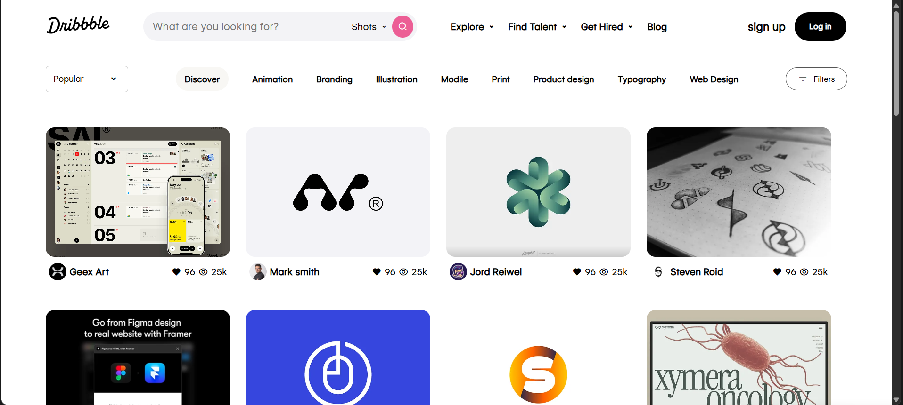
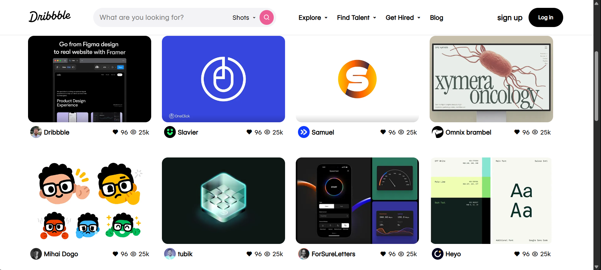
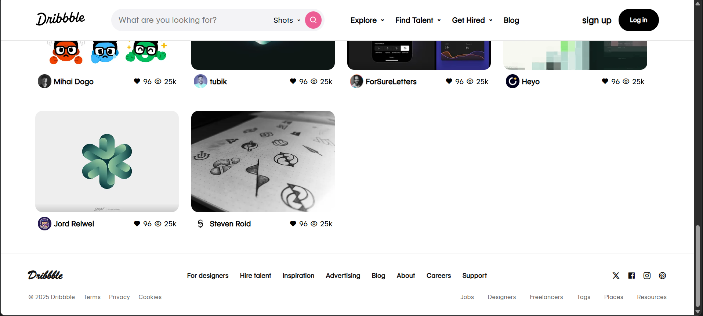

# 🎨 Dribbble Website Clone

A **Dribbble-inspired website clone** built using **HTML & CSS**. This project focuses on replicating the sleek and modern UI of Dribbble while improving front-end development skills.

---

## 📸 Preview



---

## 🎥 Demo Video

[▶ Watch Demo](./demo.mp4)

---

## 🌐 Live Demo

🔗 [Click here to view live project](https://dileep-kumawat.github.io/Dribbble-website-clone-using-html-and-css/)

---

## 🚀 Features

* 🎨 Modern and clean UI design inspired by Dribbble
* 💻 Fully responsive layout
* ⚡ Lightweight & fast loading
* 📱 Works across devices

---

## 🛠️ Tech Stack

* **HTML5**
* **CSS3** (Flexbox + Grid for layout)

---

## 📂 Project Structure

```bash
Dribbble-Clone/
│── index.html
│── style.css
│── Preview.png
│── demo.mp4
└── README.md
```

---

## 📌 How to Use

1. Clone this repository:

   ```bash
   git clone https://github.com/your-username/dribbble-clone.git
   ```
2. Navigate to project folder:

   ```bash
   cd dribbble-clone
   ```
3. Open `index.html` in your browser.

---

## 🖼️ Screenshots




---

## 💡 Future Improvements

* Add **JavaScript interactivity**
* Implement **search & filter functionality**
* Dark mode support 🌙

---

## 🤝 Contributing

Contributions are welcome! If you’d like to improve this project, feel free to fork and submit a pull request.

---

## 📜 License

This project is licensed under the **MIT License**.

---

✨ *Made with passion while learning frontend development!*

